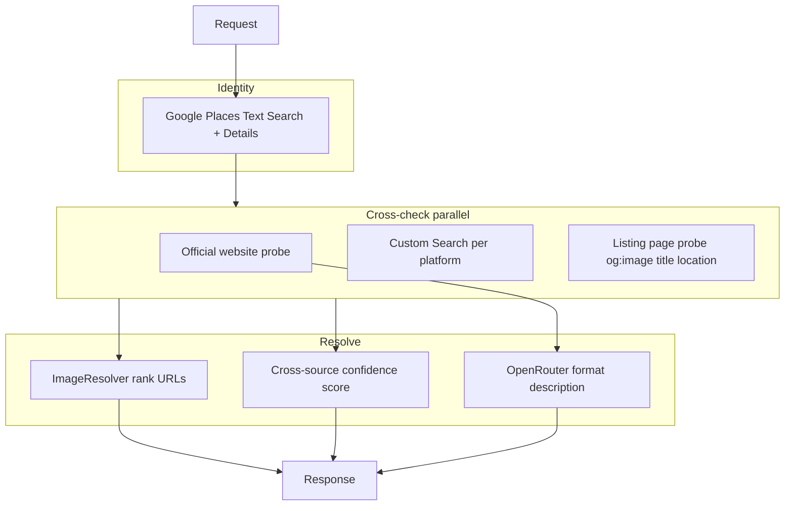

# Multi-source cross-check, confidence JSON, and Optimo dropdown

## Context (updated)

- Optimo **default input** stays minimal (`venueName`, `country`, `city`) — no `source`.
- **Cross-checking from booking/travel platforms is in scope now**, not deferred.
- Discovery uses **Google Programmable Search (Custom Search JSON API)** with `site:{domain}` queries (you confirmed CSE key + `cx` are available).
- **Image URL**: resolve the best `image` field by probing multiple sources (official site, Google Places photo, booking listings) and picking a validated HTTPS URL with highest trust + match score.
- Optimo **Apply dropdown**: `retrievalMode` + optional `platformId`; confidence visible when `?includeConfidence=true`.

Current gaps: [`CrossSourceConsistency = 8`](VenueAutofill.Api/Application/Services/VenueConfidenceService.cs) is hardcoded; controller returns only flat [`VenueAutofillStandardResponse`](VenueAutofill.Api/Contracts/Responses/VenueAutofillStandardResponse.cs) and drops outcome metadata.



---

## 1. Platform registry

New file [`VenueAutofill.Api/Data/booking-platforms.json`](VenueAutofill.Api/Data/booking-platforms.json):

| platformId | domain | label | probeEnabled |
|------------|--------|-------|--------------|
| booking.com | booking.com | Booking.com | true |
| expedia.com | expedia.com | Expedia | true |
| agoda.com | agoda.com | Agoda | true |
| hotels.com | hotels.com | Hotels.com | true |
| airbnb.com | airbnb.com | Airbnb | true |
| trip.com | trip.com | Trip.com | true |
| vrbo.com | vrbo.com | Vrbo | true |
| tripadvisor.com | tripadvisor.com | Tripadvisor | true |
| makemytrip.com | makemytrip.com | MakeMyTrip | true |
| traveloka.com | traveloka.com | Traveloka | true |
| hostelworld.com | hostelworld.com | Hostelworld | true |
| kayak.com | kayak.com | Kayak | false (metasearch — skip probe or discovery-only) |
| trivago.com | trivago.com | Trivago | false |
| google_hotels | google.com/travel/hotels | Google Hotels | false (use Places instead) |

Config in [`VenueAutofillOptions`](VenueAutofill.Api/Configuration/VenueAutofillOptions.cs):

- `MaxPlatformDiscoveryCount` (default **8** enabled platforms per request)
- `PlatformProbeTimeoutSeconds` (default **8**)
- `MaxConcurrentProbes` (default **4**)

---

## 2. Google Custom Search — listing URL discovery

New config section `GoogleCustomSearch:ApiKey`, `GoogleCustomSearch:SearchEngineId` (cx).

New provider [`GoogleCustomSearchProvider`](VenueAutofill.Api/Infrastructure/Providers/GoogleCustomSearchProvider.cs):

- Query template: `"{venueName}" {city} {country} site:{domain}`
- Returns top **1** result URL per platform (validate HTTPS, block non-listing paths where possible via simple heuristics: reject `/search`, `/s/`, homepages).
- On CSE failure/quota: mark platform `status: skipped` in `sourcesChecked`, continue pipeline (do not fail whole autofill).

Register `HttpClient` with timeout; log platform + URL found.

---

## 3. Listing probe (lightweight fetch)

New [`ListingProbeService`](VenueAutofill.Api/Infrastructure/Providers/ListingProbeService.cs) reuses existing [`UrlSafetyValidator`](VenueAutofill.Api/Infrastructure/Http/UrlSafetyValidator.cs) + [`SourceRelevanceValidator`](VenueAutofill.Api/Infrastructure/Providers/SourceRelevanceValidator.cs):

For each discovered listing URL (+ official website + user `source`):

- GET HTML (size cap ~500KB, same crawl limits as website extractor)
- Extract:
  - `og:image`, `twitter:image`
  - `application/ld+json` `Hotel` / `LodgingBusiness` → `image`, `name`, `address`
  - Page `<title>`, visible address/phone snippets (regex/heuristics)
- Output `ListingProbeResult`: `url`, `imageUrl`, `extractedName`, `extractedCity`, `extractedCountry`, `probeStatus`

**No full booking-site scraping** beyond first page metadata — enough for cross-check + image candidate.

---

## 4. Cross-source orchestration and confidence

New [`VenueCrossSourceService`](VenueAutofill.Api/Application/Services/VenueCrossSourceService.cs) implementing `IVenueCrossSourceService`:

**Always check:**

- `google_places` — request vs Place Details candidate
- `official_website` — when `candidate.Website` present

**When `retrievalMode` is `automatic`:**

- Run CSE discovery + probe for all **enabled** platforms in registry (up to `MaxPlatformDiscoveryCount`, parallel with semaphore)

**When `retrievalMode` is `bookingPlatform`:**

- CSE + probe **only** for `platformId` from request (Optimo dropdown: “Booking.com”, etc.)
- Google Places still used for map/coords/identity

**When `googlePlaces`:**

- Skip CSE and listing probes; confidence from Places only

**Per-source scoring** (`SourceCheckResult`):

- Name fuzzy match vs request + Google name (0–40)
- City/country match (0–30)
- Optional phone/email match (0–20)
- Image found + URL reachable HEAD (0–10)
- `status`: `matched` (≥70), `partial` (40–69), `failed` (<40), `skipped`, `blocked`

**`CrossSourceConsistency` (0–15 in breakdown):**

- Weighted average of platform scores; bonus if ≥3 platforms `matched`; penalty if top platform contradicts Google coords/name

Replace fixed `8` in [`VenueConfidenceService`](VenueAutofill.Api/Application/Services/VenueConfidenceService.cs); call cross-source service **post-probe** before final success response.

---

## 5. Image URL resolution

New [`ImageResolverService`](VenueAutofill.Api/Application/Services/ImageResolverService.cs):

**Priority order** (highest wins if probe score ≥ threshold):

1. User `source` listing image (if `customSource` and probe matched)
2. Official website `og:image` / schema image (trusted domain boost)
3. Google Places photo URL (existing [`GetPhotoUrlAsync`](VenueAutofill.Api/Infrastructure/Providers/GooglePlacesProvider.cs))
4. Best **matched** booking-platform listing image (highest `SourceCheckResult.score` among platforms with `imageUrl`)
5. Empty string + warning `"No validated image URL found across sources"`

Store in response metadata when `includeConfidence=true`:

- `imageSource`: `{ sourceId, label, url }`
- `imageCandidates[]`: optional list of alternate URLs for Optimo UI (top 3)

Final `image` field on success uses resolver output (not only `extracted.ImageUrl ?? photoUrl`).

---

## 6. Optimo dropdown → API contract

Add to [`VenueAutofillRequest`](VenueAutofill.Api/Contracts/Requests/VenueAutofillRequest.cs):

```json
{
  "venueName": "The Westin Bonaventure Hotel & Suites",
  "country": "United States",
  "city": "Los Angeles",
  "retrievalMode": "automatic",
  "platformId": null,
  "source": null
}
```

| Dropdown | retrievalMode | platformId | source |
|----------|---------------|------------|--------|
| Retrieve automatically | automatic | null | null |
| Official website | officialWebsite | null | null |
| Google/Maps | googlePlaces | null | null |
| Booking.com (etc.) | bookingPlatform | booking.com | null |
| Specific URL | customSource | null | required URL |

Confirm endpoint: pass same `retrievalMode` / `platformId` on [`VenueAutofillConfirmRequest`](VenueAutofill.Api/Contracts/Requests/VenueAutofillConfirmRequest.cs) or persist from ambiguous session cache.

---

## 7. JSON response (`includeConfidence`)

Query: `POST /api/venue-autofill?includeConfidence=true`

Default `false` — flat Jon contract unchanged.

When `true`, add to success body:

```json
{
  "name": "...",
  "image": "https://...",
  "confidenceScore": 88,
  "confidenceBreakdown": { "nameMatch": 28, "locationMatch": 22, "venueTypeMatch": 8, "sourceReliability": 9, "dataCompleteness": 8, "crossSourceConsistency": 13 },
  "sourceUsed": "https://www.marriott.com/...",
  "imageSource": { "sourceId": "official_website", "label": "Official website", "url": "https://..." },
  "sourcesChecked": [
    { "sourceId": "google_places", "label": "Google Places", "status": "matched", "score": 94, "matchedFields": ["name","city","country"], "url": null },
    { "sourceId": "booking.com", "label": "Booking.com", "status": "matched", "score": 82, "matchedFields": ["name","city"], "url": "https://www.booking.com/hotel/..." }
  ],
  "warnings": []
}
```

Ambiguous options: include `sourcesChecked` summary per option when flag set (may be discovery-only without full probe to save latency — **probe only top 2 candidates**).

---

## 8. Pipeline integration

[`VenueAutofillService.EnrichCandidateAsync`](VenueAutofill.Api/Application/Services/VenueAutofillService.cs) order:

1. Place Details + photo name
2. **Cross-source discovery + probes** (mode-dependent)
3. Website extraction + AI (skip for `googlePlaces`; narrow for `bookingPlatform`)
4. **ImageResolver** → set `image`
5. Recompute confidence with real cross-source score
6. Build outcome with metadata for controller

[`WebsiteExtractionProvider`](VenueAutofill.Api/Infrastructure/Providers/WebsiteExtractionProvider.cs): respect `retrievalMode` URL list (unchanged from prior plan).

---

## 9. Configuration and ops

**New secrets** (user-secrets / App Service settings):

- `GoogleCustomSearch:ApiKey`
- `GoogleCustomSearch:SearchEngineId`

**Cost control:** 8 CSE queries × autofill request — document in README; optional `VenueAutofill:EnablePlatformCrossCheck` flag (default `true`) to disable CSE in dev.

**Rate limits:** extend existing rate limiter; add per-request timeout budget (e.g. 45s total) so slow probes do not hang API.

**Legal note in README:** listing probes fetch public page metadata only; no login bypass; respect robots where blocked — platform marked `skipped`.

---

## 10. Files to add/change

| Component | Path |
|-----------|------|
| Registry | `Data/booking-platforms.json` |
| CSE provider | `Infrastructure/Providers/GoogleCustomSearchProvider.cs` |
| Listing probe | `Infrastructure/Providers/ListingProbeService.cs` |
| Cross-source | `Application/Services/VenueCrossSourceService.cs` |
| Image resolver | `Application/Services/ImageResolverService.cs` |
| Contracts | `RetrievalMode`, `SourceCheckResult`, `ImageSourceInfo`, metadata response |
| Config | `GoogleCustomSearchOptions`, extend `VenueAutofillOptions`, `appsettings.json` placeholders |
| DI | `Program.cs` register HttpClients + services |
| API | `VenueAutofillController` + validators |
| Docs | `README.md`, Postman samples |

**Dependencies:** existing HtmlAgilityPack; no new NuGet required unless JSON-LD parsing needs `System.Text.Json` nodes only.

---

## 11. Removed from plan

- ~~Phase 2 booking platforms~~ — now core scope.
- ~~Google-only cross-check POC~~ — superseded by platform registry + CSE + probes.

---

## Test plan (for implementation)

1. Hotel in LA with `retrievalMode=automatic`, `includeConfidence=true` → `sourcesChecked` includes booking.com/expedia with `matched` or `partial`, non-empty `image` with `imageSource`.
2. `retrievalMode=bookingPlatform`, `platformId=booking.com` → only that platform in `sourcesChecked` besides `google_places`.
3. CSE disabled / invalid key → autofill still succeeds with warning, platforms `skipped`.
4. Ambiguous flow: top candidates show `confidenceScore`; confirm preserves `retrievalMode`.
