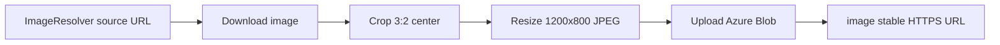

# Venue images (1200×800, Azure Blob) + canonical amenities

## Part A — Image normalization and Azure Blob delivery

### Requirement

- **Ratio:** 3:2 (e.g. **1200×800** px)
- **Delivery:** After normalize → **upload to Azure Blob** (or compatible storage) → return **stable HTTPS URL** in JSON `image` field (not a transient Google/OG URL)

**Today:** [`image`](VenueAutofill.Api/Contracts/Responses/VenueAutofillStandardResponse.cs) passthrough from [`ImageResolverService`](VenueAutofill.Api/Application/Services/ImageResolverService.cs); Google uses `maxHeightPx=800` only ([`GooglePlacesProvider`](VenueAutofill.Api/Infrastructure/Providers/GooglePlacesProvider.cs)).

### Target pipeline



1. Download source image (SSRF-safe, size cap, timeout).
2. **Center-crop to 3:2**, resize to **1200×800**, encode JPEG (quality ~85).
3. Upload to blob path `venue-images/{cacheKey}.jpg` (`cacheKey` = hash of source URL + dimensions version).
4. Set response **`image`** = public/blob CDN HTTPS URL.
5. On failure: fallback to **original source URL** + warning (do not fail autofill).

**Removed from plan:** on-API proxy as primary delivery (`GET /api/venue-images/{key}`). Optional **dev-only** fallback below.

### Azure Blob storage (required for production)

New [`AzureBlobImageStorage`](VenueAutofill.Api/Infrastructure/Storage/AzureBlobImageStorage.cs) using **Azure.Storage.Blobs**:

| Config (`AzureBlobStorage` section) | Purpose |
|-------------------------------------|---------|
| `ConnectionString` | Dev/local (user-secrets); empty in repo |
| `ContainerName` | e.g. `venue-images` |
| `PublicBaseUrl` | Optional CDN/custom domain; if empty use `https://{account}.blob.core.windows.net/{container}/` |
| `UseManagedIdentity` | App Service / AKS production auth |

- Container: **blob public read** for anonymous `image` URLs, **or** long-lived CDN in front (document setup in README).
- Upload: `Content-Type: image/jpeg`, overwrite if same `cacheKey` (idempotent).
- **Local dev:** [Azurite](https://learn.microsoft.com/azure/storage/common/storage-use-azurite) + connection string `UseDevelopmentStorage=true`, or skip upload with warning when not configured.

### Configuration (`ImageNormalization`)

| Setting | Default |
|---------|---------|
| `Enabled` | `true` |
| `TargetWidth` | `1200` |
| `TargetHeight` | `800` |
| `JpegQuality` | `85` |
| `MaxDownloadBytes` | `5_000_000` |
| `DownloadTimeoutSeconds` | `15` |

Google Places photo URL: **`maxWidthPx=1200&maxHeightPx=800`** before download.

### Response JSON

Success body (always):

```json
"image": "https://{storage}/venue-images/{cacheKey}.jpg"
```

When `includeConfidence=true`, also:

- `imageOriginalUrl` — source URL before normalization
- `imageWidth`: 1200, `imageHeight`: 800, `imageAspectRatio`: `"3:2"`

### NuGet

- `SixLabors.ImageSharp`
- `Azure.Storage.Blobs`

---

## Part B — Canonical amenities with near-match

### Requirement

Response `amenities` must map extracted/AI text to this **canonical Optimo list** (near matches supported):

| Canonical label |
|-----------------|
| Free high-speed internet |
| Gym/fitness center |
| Complimentary breakfast |
| Swimming pool |
| Parking |
| Pet friendly |
| Meeting event space |
| Room service |
| Laundry service |
| Spa |
| Barber |
| Concierge desk |
| Cocktail lounge |
| Mobility accessible rooms |

**Examples:** `"Parking"`, `"Free parking"`, `"Onsite parking"` → **`Parking`**. `"Gym"`, `"Fitness centre"` → **`Gym/fitness center`**.

### Today

[`amenities-map.json`](VenueAutofill.Api/Data/amenities-map.json) maps a small set to different display names (e.g. `"pool"` → `"Outdoor Pool"`). [`OpenRouterAiProvider.NormalizeAmenities`](VenueAutofill.Api/Infrastructure/Providers/OpenRouterAiProvider.cs) does exact key lookup only; unknown items pass through with capitalization; capped at 15 items.

### Target behavior

1. Replace/extend with [`Data/amenities-canonical.json`](VenueAutofill.Api/Data/amenities-canonical.json):

```json
[
  {
    "canonical": "Parking",
    "aliases": ["parking", "free parking", "onsite parking", "valet parking", "self parking", ...]
  },
  ...
]
```

2. New [`AmenityNormalizationService`](VenueAutofill.Api/Application/Services/AmenityNormalizationService.cs):
   - Input: raw strings from website extraction + AI.
   - For each raw line, match if **any alias** matches using:
     - Normalized contains (both directions)
     - Token overlap (e.g. `free` + `parking` → Parking)
     - Optional simple fuzzy ratio threshold (~0.75) for typos
   - Output: **distinct canonical labels only**, stable order (canonical list order, not discovery order).
   - **Do not invent** amenities not evidenced in raw text.
3. Update AI system prompt in [`OpenRouterAiProvider`](VenueAutofill.Api/Infrastructure/Providers/OpenRouterAiProvider.cs) to emit canonical names from the list when possible.
4. Run normalization **after** AI merge in `FormatAsync` (and on keyword extraction path in [`WebsiteExtractionProvider`](VenueAutofill.Api/Infrastructure/Providers/WebsiteExtractionProvider.cs)).
5. Hotels: if zero amenities matched, keep existing warning `"Amenities not found on source website."`

### Alias coverage (implement in JSON)

Each canonical entry should include common variants, e.g.:

- **Free high-speed internet:** wifi, wireless, high speed internet, free internet
- **Gym/fitness center:** gym, fitness, fitness center, fitness centre, health club
- **Complimentary breakfast:** free breakfast, breakfast included, continental breakfast
- **Swimming pool:** pool, outdoor pool, indoor pool
- **Meeting event space:** conference, meeting room, banquet, event space
- **Mobility accessible rooms:** accessible, wheelchair, ada, mobility accessible

---

## Part C — Other bundled fix

Fix [`BookingPlatformRegistry`](VenueAutofill.Api/Infrastructure/Data/BookingPlatformRegistry.cs): `JsonSerializerOptions.PropertyNameCaseInsensitive = true` for [`booking-platforms.json`](VenueAutofill.Api/Data/booking-platforms.json).

---

## Implementation order

1. Amenities canonical JSON + `AmenityNormalizationService` + wire formatter/extraction
2. Image normalization + Azure Blob upload + wire `VenueAutofillService`
3. Config, README (Blob container setup, Azurite, managed identity), Postman notes
4. Booking platform registry fix

---

## Out of scope

- Image proxy endpoint as production path
- Amenity icons / categories beyond string list
- Normalizing images on ambiguous `options[]` entries
- WebP/AVIF variants

---

## Test plan

**Images**

1. Configure Azurite or dev storage → autofill success → `image` is `https://...blob.../venue-images/{key}.jpg`; downloaded file is **1200×800**, 3:2.
2. Blob not configured → warning + fallback original URL (dev only).
3. Repeat same venue → same blob path (idempotent, no duplicate blobs).

**Amenities**

1. Extracted text contains `"Free parking"` → `amenities` includes `"Parking"` only (canonical spelling).
2. Text contains `"Fitness centre"` and `"gym"` → single `"Gym/fitness center"`.
3. Unrelated text `"Rooftop terrace"` → not in list unless we add alias (should not appear).
4. Mock mode: amenities use canonical labels in sample.

---

## Files to add/change

| Area | Files |
|------|--------|
| New | `amenities-canonical.json`, `AmenityNormalizationService.cs`, `IAmenityNormalizationService.cs`, `ImageNormalizationService.cs`, `IImageNormalizationService.cs`, `AzureBlobImageStorage.cs`, `ImageNormalizationOptions.cs`, `AzureBlobStorageOptions.cs`, `NormalizedImageResult.cs` |
| Change | `VenueAutofillService.cs`, `OpenRouterAiProvider.cs`, `WebsiteExtractionProvider.cs`, `GooglePlacesProvider.cs`, `Program.cs`, `appsettings.json`, `VenueAutofillSuccessWithConfidenceResponse.cs`, `README.md`, `VenueAutofill.Api.csproj`, `BookingPlatformRegistry.cs` |
| Deprecate | `amenities-map.json` (replace usage with canonical file) |
