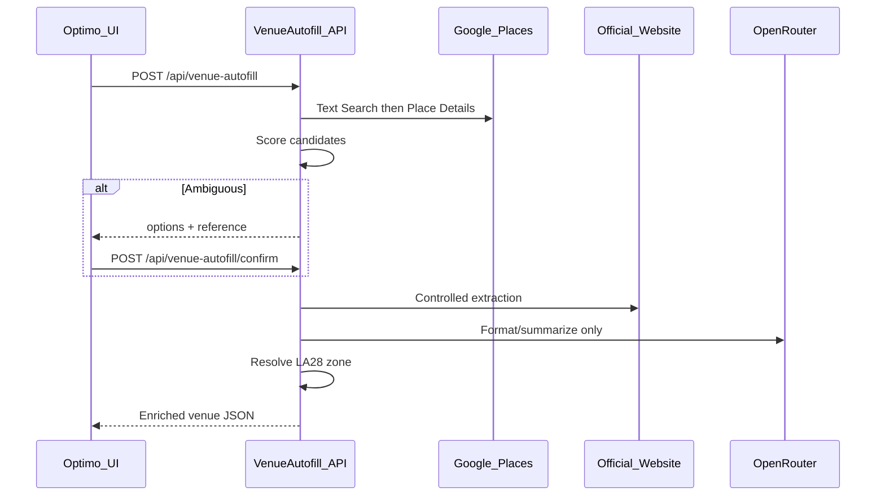

# Venue Autofill API — Build Plan

## Scenario (confirmed)

You are building a **backend-only** enrichment API for **Optimo**, not a UI.



**Business goal (from [venue-autofill-prd.md](venue-autofill-prd.md)):** When a user enters minimal venue data (`venueName`, `country`, `city`, `venueType`, optional `area`/`source`), the API auto-fills rich fields (rating, amenities, description, image, coordinates, phone, email, LA28 `location` zone, hotel check-in/out) so hundreds of demo venues can be populated quickly for Jon’s Optimo presentation (LA28 context).

**Hard rules:**
- Google Places decides **which venue** — AI never picks identity.
- AI (via **OpenRouter**, per your keys) only summarizes/normalizes extracted text.
- No unlimited crawling; SSRF protection on user `source` URLs.
- `location` = LA28 zone label (e.g. `"Inglewood Zone"`), not street address.

**Current repo state:** Only the PRD exists — no code yet.

---

## Auth recommendation (your question)

| Environment | Recommendation |
|-------------|----------------|
| **Local POC** | No auth initially (faster iteration); enable Swagger. |
| **Production / shared env** | **API key in header** (`X-Api-Key`) — best fit for Optimo → internal service calls; simple rotation, no JWT issuer needed. |
| **Alternative** | Bearer static token — equivalent security if managed the same way. |

Auth is not “production-only,” but it is **required before exposing the API beyond localhost**. Plan step 13 adds it; POC can run without it locally.

---

## Tech stack (adjusted for your keys)

| Component | Choice |
|-----------|--------|
| Framework | ASP.NET Core 10 Web API, controller-based |
| Discovery | Google Places API (New) — Text Search → Place Details → Photos |
| AI | **OpenRouter** (OpenAI-compatible HTTP API) — model from config (e.g. `openai/gpt-4.1-mini` or equivalent on OpenRouter) |
| Ambiguous sessions | `IMemoryCache` (POC) |
| Zones | Static [`Data/la28-zones.json`](Data/la28-zones.json) keyword resolver |
| Secrets | User secrets / env vars — never commit keys |

Update [`AiOptions`](Configuration/AiOptions.cs) in PRD from `Provider: OpenAI` to `BaseUrl: https://openrouter.ai/api/v1`, `ApiKey`, `Model`.

---

## Solution layout

Single solution per PRD §18:

```
VenueAutofill.Api/
├── Controllers/VenueAutofillController.cs
├── Application/Interfaces + Services (orchestrator, confidence, zone)
├── Infrastructure/Providers (GooglePlaces, WebsiteExtraction, OpenRouter)
├── Infrastructure/Http (SafeHttpClient, UrlSafetyValidator)
├── Infrastructure/Caching/MemoryAmbiguousSearchCache.cs
├── Contracts/Requests + Responses + Internal models
├── Data/la28-zones.json, amenities-map.json
├── Configuration/*.Options.cs
├── Program.cs, appsettings.json
└── tests/ (optional later — not in PRD MVP)
```

---

## API contract summary

| Endpoint | Purpose |
|----------|---------|
| `POST /api/venue-autofill` | Main search + enrich or ambiguous/not_found |
| `POST /api/venue-autofill/confirm` | Resolve cached ambiguous selection by `reference` + `optionId` |

**Response shapes** (from PRD §9–12):
- **Success (200):** Clean venue object (name, venueType, rating, amenities, description, image, country, location, lat/lng, mapUrl, email, phone; check-in/out only for `Hotel`).
- **Ambiguous (200):** `{ status, reference, message, options[] }`.
- **Not found (200):** `{ status, reference, message, warnings[] }`.
- **Validation (400):** Missing fields, bad venue type, unsafe `source` URL.
- **Error (500/502):** `{ status, message, traceId }` on provider failures.

Internally always retain `confidenceScore`, `sourceUsed`, `warnings` for logging — even if omitted from external success body.

---

## Implementation phases (follow PRD §25 order)

### Phase 1 — Skeleton and contracts (steps 1–4)

1. `dotnet new webapi` → target **net10.0** (or latest installed SDK matching “ASP.NET Core 10”).
2. Add folders, options classes, DTOs from PRD §20.
3. **Mock controller** returning sample success / ambiguous / not_found JSON (Westin Bonaventure examples from PRD) — switchable via query flag or config `UseMocks: true`.
4. FluentValidation or data annotations + `UrlSafetyValidator` (localhost, private IPs, non-http(s) blocked).

**Exit criteria:** Postman can hit both endpoints with deterministic mock data.

### Phase 2 — Google Places + confidence (steps 5–7)

5. [`GooglePlacesProvider`](Infrastructure/Providers/GooglePlacesProvider.cs): Text Search with field mask, map to `VenueCandidate`.
6. Place Details + Photo media URL builder.
7. [`VenueConfidenceService`](Application/Services/VenueConfidenceService.cs): weighted scoring (name 30%, location 30%, type 10%, source 10%, completeness 10%, consistency 10%); thresholds from config; **ambiguity if top two within `AmbiguousScoreGap` (10)** or score 50–74.

[`VenueAutofillService`](Application/Services/VenueAutofillService.cs) orchestrates: discover → score → branch.

**Exit criteria:** Real Google search returns success or ambiguous for known LA hotels; not_found for nonsense names.

### Phase 3 — Ambiguous flow (steps 8–9)

8. [`MemoryAmbiguousSearchCache`](Infrastructure/Caching/MemoryAmbiguousSearchCache.cs): store candidates by `reference`, TTL from `AmbiguousCacheMinutes` (60).
9. Confirm endpoint: load candidate by `optionId` → run enrichment pipeline → standard response; 404 if expired.

**Exit criteria:** Full ambiguous → confirm → success path works end-to-end.

### Phase 4 — Enrichment (steps 10–12)

10. Load [`la28-zones.json`](Data/la28-zones.json) + [`ZoneResolverService`](Application/Services/ZoneResolverService.cs) (keyword match on area/address/city).
11. [`WebsiteExtractionProvider`](Infrastructure/Providers/WebsiteExtractionProvider.cs): fetch official site (from Place Details or user `source`), max 3 pages, extract text/amenities/times/email/image candidates; validate `source` against venue name + location.
12. [`AiVenueFormatterService`](Application/Services/AiVenueFormatterService.cs) via OpenRouter: strict prompt — no invented data, description ≤ 35 words, normalize amenities using [`amenities-map.json`](Data/amenities-map.json).

**Exit criteria:** Hotel success includes zone label, normalized amenities, AI summary; Stadium returns null check-in/out.

### Phase 5 — Hardening and docs (steps 13–14)

13. Structured logging (reference, scores, warnings — no secrets); Polly timeouts on HTTP clients; request size limits; optional `X-Api-Key` middleware; rate limiting (`AspNetCoreRateLimit` or built-in .NET 10 rate limiter).
14. Swagger annotations, Postman collection, README (env vars: `GooglePlaces__ApiKey`, `AI__ApiKey`, `AI__BaseUrl`, `AI__Model`), sample payloads.

**Exit criteria:** PRD §24 acceptance criteria pass.

---

## Key configuration ([appsettings.json](appsettings.json))

```json
{
  "GooglePlaces": { "ApiKey": "", "BaseUrl": "https://places.googleapis.com/v1" },
  "VenueAutofill": {
    "UseMocks": false,
    "AmbiguousCacheMinutes": 60,
    "MinimumSuccessConfidence": 75,
    "AmbiguousScoreGap": 10,
    "MaxExtractionPages": 3
  },
  "AI": {
    "Provider": "OpenRouter",
    "BaseUrl": "https://openrouter.ai/api/v1",
    "ApiKey": "",
    "Model": "openai/gpt-4.1-mini"
  }
}
```

Use `dotnet user-secrets` for local keys.

---

## Dependencies (NuGet)

- `Microsoft.Extensions.Http.Polly` — retries/timeouts
- `FluentValidation.AspNetCore` (optional) — request validation
- `HtmlAgilityPack` or `AngleSharp` — website text extraction
- No OpenAI SDK required if using raw HTTP to OpenRouter

---

## Risks and mitigations

| Risk | Mitigation |
|------|------------|
| Google Places cost/field bloat | Strict field masks on Text Search and Details |
| Wrong venue selected | Confidence + 10-point ambiguity gap |
| SSRF via `source` | `UrlSafetyValidator` before any fetch |
| AI hallucination | Prompt: only use provided text; empty if missing |
| OpenRouter model name differs | Config-driven `AI:Model`; verify once in README |

---

## Out of scope (per PRD)

- Optimo UI / dropdown implementation
- Redis cache, geo polygons for zones
- General web scraping / Google search page scraping
- Booking logic (not in PRD)

---

## Deliverables checklist

- [ ] `VenueAutofill.Api` source
- [ ] `la28-zones.json`, `amenities-map.json`
- [ ] Swagger + Postman + README + env guide
- [ ] Sample payloads (Westin success, ambiguous 2-option, not_found)
